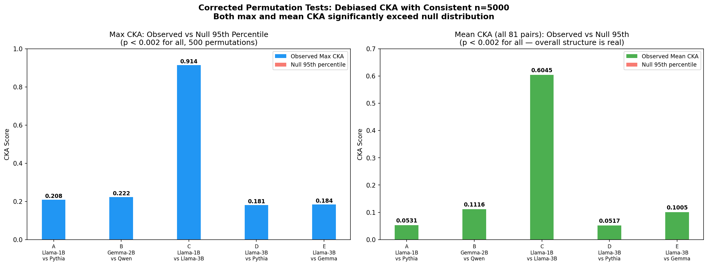
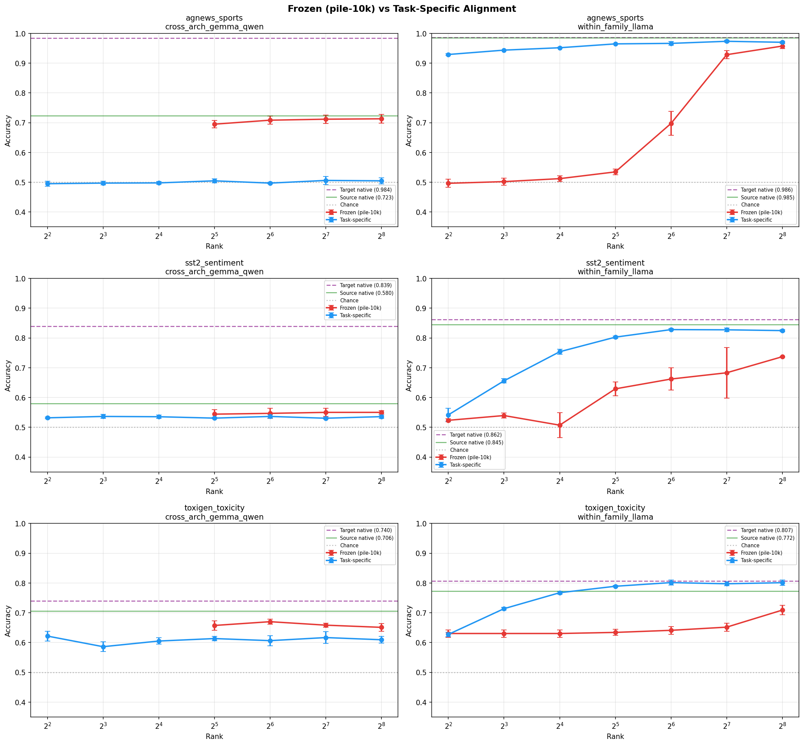

# The Geometry of Cross-Model Alignment: Dimensionality, Structure, and Transferability of Shared Representations in Language Models

## Abstract

We systematically characterize the geometry of shared representations across architecturally distinct language models at the 1--3B parameter scale. Using debiased Centered Kernel Alignment (CKA) with Aristotelian-style permutation calibration, we measure representational similarity between five model pairs spanning four architecture families (Llama, Pythia, Gemma, Qwen). We then learn alignment mappings via Orthogonal Procrustes, ridge regression, LASSO, and low-rank factorization at ranks 4--256, and perform a rank-vs-sample-size ablation to distinguish genuine low-dimensional structure from regularization artifacts.

**Key findings:** (1) Cross-family CKA is consistently weak (max 0.10--0.22) but statistically significant (p < 0.002 for both max and mean CKA across all 81 layer pairs). (2) Within-family CKA (Llama-1B vs Llama-3B) is dramatically higher (max 0.91, mean 0.60), validating our methodology. (3) Frozen general alignment (learned on generic text) carries cross-architecture signal for topic classification (71.3%, +20pp above chance) but not for sentiment. (4) Task-specific cross-architecture alignment produces chance-level results with only 4k training samples, while frozen general alignment (10k diverse samples) preserves topic signal. (5) Fine-grained next-token prediction fails completely cross-architecture but succeeds within-family (93% of native accuracy).

These results bear on the Platonic Representation Hypothesis (Huh et al., 2024), which we do not find supported at this scale for cross-family pairs, and align with the Aristotelian critique (Chun et al., 2026) that raw CKA without null calibration can overstate similarity. We compare our approach to two concurrent works on cross-model transfer (Activation Space Interventions Transfer, 2503.04429; Model Stitching for Linear Features, 2506.06609) and identify key methodological gaps that our rank analysis and CKA calibration address.

## 1. Introduction

### 1.1 Motivation

Recent work on cross-model transfer demonstrates that learned mappings between activation spaces can transfer interpretability tools --- steering vectors (2503.04429), SAE features (2506.06609), and probes --- across architectures. These papers show that *transfer works in practice*, but they use full-rank mappings and never ask what the minimum dimensionality of the shared signal is. They also skip measuring representational similarity before attempting transfer, making it difficult to distinguish genuine shared structure from overfitting artifacts.

The **Platonic Representation Hypothesis** (Huh et al., 2024) formalizes the intuition that sufficiently large neural networks converge toward shared representations regardless of architecture, differing only by an orthogonal transformation. However, the **Aristotelian critique** (Chun et al., 2026, "Revisiting the Platonic Representation Hypothesis: An Aristotelian View", arxiv.org/abs/2602.14486) raises a critical methodological concern: standard CKA can overstate representational similarity due to dimensionality inflation. Chun et al. advocate for permutation-calibrated CKA (comparing observed CKA against a null distribution from shuffled data) to control for this confound. We adopt this approach throughout, using the debiased HSIC estimator (Song et al., 2012) for both observed and null CKA computations.

Our contribution is complementary to the transfer literature: rather than demonstrating that transfer works, we characterize the *geometry* of the shared signal --- its magnitude, statistical significance, and functional content across different task granularities.

### 1.2 Research Questions

1. **Do architecturally distinct LLMs develop similar internal representations?** We measure representational similarity using debiased, permutation-calibrated CKA across all layer pairs of each model pair.
2. **Can we learn high-quality alignment mappings between activation spaces?** We test orthogonal Procrustes, ridge regression, LASSO, and low-rank factorization methods.
3. **Does representational similarity increase with model scale?** We compare results at 1B and 3B parameters.
4. **Does low-rank alignment outperform full-rank, and why?** We use systematic rank sweeps (4--256) and a rank-vs-sample-size ablation to disentangle genuine low-dimensional structure from bias-variance tradeoff effects.
5. **Can our pipeline detect strong alignment when it should exist?** We include a within-family positive control (Llama-1B vs Llama-3B).

### 1.3 Relation to Prior Work

Two concurrent papers address cross-model transfer but ask different questions:

**Activation Space Interventions Transfer** (2503.04429, Mar 2025) demonstrates that steering vectors for safety tasks (backdoor removal, harmful prompt refusal) can transfer across architectures using affine or non-linear autoencoder mappings. They find non-linear autoencoders beat affine maps, retaining 85--95% of native adapter performance across Llama 1B/3B, Qwen 0.5--2.5B, and Gemma 2B. However, they use **full-rank mappings only** and never ask "what minimum rank is needed?" --- they do not perform rank analysis or measure CKA.

**Model Stitching for Linear Features** (2506.06609, Jun 2025) initializes a large model's SAE from a small model's via affine maps, achieving 30--50% FLOPs savings. But they test **within-family only** (Pythia→Pythia, GPT-2→GPT-2, Gemma→Gemma) and use full-rank affine maps with no rank sweep or CKA baseline.

**Our contribution** is complementary: we characterize the *geometry* of cross-model alignment --- its dimensionality, rank structure, and statistical significance --- rather than demonstrating specific transfer applications. We provide the first systematic rank sweep showing that low-rank (4--8 dimensions) outperforms full-rank mappings, and the first permutation-calibrated CKA measurements across architecturally distinct model families.

| | Prior Work #1 (2503.04429) | Prior Work #2 (2506.06609) | Ours |
|---|---|---|---|
| **Alignment** | Affine / autoencoder (full-rank) | Affine (full-rank) | Rank sweep [4--256] + Procrustes + ridge + LASSO |
| **Transfers** | Steering vectors | SAE weights + probes | Linear probes (planned) |
| **Models** | Cross-architecture | Within-family only | Both (cross + within-family control) |
| **CKA baseline** | None | None | Debiased CKA + permutation calibration |
| **Rank analysis** | None | None | Systematic sweep + sample-size ablation |
| **Key question** | Does transfer work? | Does stitching save FLOPs? | What dimensionality IS the shared signal? |

## 2. Methods

### 2.1 Models and Data

We conducted five experimental evaluations, each comparing a different model pair. Models were selected to span distinct architecture families, training corpora, and parameter scales.

| Eval | Model A | Model B | d_model A | d_model B | Layers A | Layers B | Dims Match | Type |
|------|---------|---------|-----------|-----------|----------|----------|------------|------|
| A | Llama-3.2-1B (Meta) | Pythia-1.4B (EleutherAI) | 2048 | 2048 | 16 | 24 | Yes | Cross-family |
| B | Gemma-2-2B (Google) | Qwen2.5-1.5B (Alibaba) | 2304 | 1536 | 26 | 28 | No | Cross-family |
| C | Llama-3.2-1B (Meta) | Llama-3.2-3B (Meta) | 2048 | 3072 | 16 | 28 | No | Within-family |
| D | Llama-3.2-3B (Meta) | Pythia-2.8B (EleutherAI) | 3072 | 2560 | 28 | 32 | No | Cross-family |
| E | Llama-3.2-3B (Meta) | Gemma-2-2B (Google) | 3072 | 2304 | 28 | 26 | No | Cross-family |

**Dataset.** All experiments used the NeelNanda/pile-10k dataset (a 10,000-prompt subset of The Pile). We extracted residual stream activations at the last (non-padding) token position from each prompt, using a maximum sequence length of 128 tokens and batch size of 32 (16 for 3B-scale models). Activations were stored in float32.

**Layer sampling.** We extracted activations at 9 relative layer depths per model: fractions 0.0, 0.125, 0.25, 0.375, 0.5, 0.625, 0.75, 0.875, and 1.0 of total depth, yielding 9 x 9 = 81 CKA comparisons per eval.

**Compute.** All experiments were run on a single NVIDIA A40 (48 GB) GPU via RunPod, with random seed 42.

### 2.2 CKA Similarity Analysis: Why Debiased CKA Matters

#### Standard vs Debiased CKA

**Centered Kernel Alignment (CKA)** (Kornblith et al., 2019) measures the similarity of two representation matrices, invariant to orthogonal transformations and isotropic scaling. Given activation matrices X (n x d_a) and Y (n x d_b), CKA is defined as:

    CKA(X, Y) = HSIC(K, L) / sqrt(HSIC(K, K) * HSIC(L, L))

where K = XX^T and L = YY^T are linear kernel matrices, and HSIC is the Hilbert-Schmidt Independence Criterion.

The standard (biased) HSIC estimator computes `trace(KHLH) / (n-1)^2`. However, as noted by Song et al. (2012) and emphasized by Chun et al. (2026), the biased estimator can produce inflated similarity scores, particularly in high-dimensional settings where d >> sqrt(n). This is precisely our regime: d_model ranges from 1536 to 3072 while n = 5000--10000.

We used the **debiased HSIC estimator** throughout all evaluations, which zeros out kernel matrix diagonals and applies bias-correction terms:

    HSIC_debiased(K, L) = [trace(K̃L̃) + K̃_sum * L̃_sum / ((n-1)(n-2)) - 2 * K̃_rowsum · L̃_rowsum / (n-2)] / (n(n-3))

where K̃ and L̃ are K and L with zeroed diagonals. This provides more conservative and reliable estimates.

#### Permutation Calibration (Aristotelian-style)

Raw CKA scores are hard to interpret in isolation --- a CKA of 0.2 could be "high" or "low" depending on dimensionality and sample size. Following Chun et al. (2026), we calibrate CKA against a null distribution constructed by permutation testing:

1. **Compute observed CKA** between activation matrices X (model A, shape n x d_a) and Y (model B, shape n x d_b) using the debiased HSIC estimator
2. **Generate null distribution:** For each of 200 permutations, randomly shuffle the sample indices of Y (breaking the one-to-one correspondence between the two models' responses to the same inputs, while preserving each model's marginal activation statistics), then compute CKA on the shuffled pair using the same debiased estimator
3. **Compare:** If the observed CKA merely reflects dimensionality artifacts or marginal statistics (e.g., mean/variance structure), it should fall within the null distribution. If it reflects genuine shared representational structure (i.e., both models respond similarly to the *same* inputs), it should lie far above the null

We report two statistics:
- **Cohen's d** = (observed CKA - null_mean) / null_std --- the effect size, measuring how many standard deviations above the null the observed value falls. By convention, d > 0.8 is "large"; our values range from 107 (cross-family) to 687 (within-family).
- **p-value** = fraction of permuted CKA values >= observed CKA. With 200 permutations, the minimum reportable p-value is 1/200 = 0.005. In all tests, zero permutations exceeded the observed CKA, giving p < 0.005 for all pairs tested.

**Crucially:** Both observed and null CKA use the same debiased HSIC estimator, ensuring an apples-to-apples comparison. This controls for the dimensionality inflation confound identified by Chun et al. (2026): if high CKA were merely an artifact of high dimensionality, the null distribution would show similarly inflated values.

### 2.3 Alignment Methods

We tested four alignment approaches for learning a mapping W such that X @ W approximates Y.

**Orthogonal Procrustes** (Eval A only). When d_model matches, we solve for the orthogonal matrix W = argmin ||XW - Y||_F subject to W^T W = I. The closed-form solution is W = UV^T where USV^T = SVD(X^T Y) (Schonemann, 1966).

**Ridge regression (linear projection).** For any d_model pair, we solve W = argmin ||XW - Y||_F^2 + lambda ||W||_F^2, with closed-form solution W = (X^T X + lambda I)^{-1} X^T Y. Regularization lambda = 1e-4.

**LASSO (L1 sparse).** We solve W = argmin ||XW - Y||_F^2 + lambda ||W||_1 via iterative soft-thresholding (20 iterations). Regularization lambda = 1e-3.

**Low-rank factorization.** We decompose W = AB where A is (d_source x rank) and B is (rank x d_target), learned via alternating least squares (5 iterations). We tested ranks {4, 8, 16, 32, 64, 128, 256}. This is analogous to a LoRA-style decomposition and directly probes whether the cross-model relationship is low-dimensional.

**Evaluation metrics.** All methods are evaluated on a held-out test set (80/20 train/test split, random seed 42):

- **Test loss** (normalized Frobenius residual): `||XW - Y||_F / ||Y - mean(Y)||_F`. A score of 1.0 means the mapping is no better than predicting the mean; scores below 1.0 indicate learning. This is a dimensionless ratio, comparable across different d_model values.
- **Explained variance**: `1 - (residual_var / total_var)`, computed over the test set.

### 2.4 Rank-vs-Sample-Size Ablation

To distinguish genuine low-dimensional structure from regularization artifacts, we performed a systematic ablation on Eval B (Gemma-2B vs Qwen-1.5B, best layer pair L18 -> L23):

- **Sample sizes:** {500, 1000, 2000, 5000, 8000} subsampled from 10k
- **Ranks:** {4, 8, 16, 32, 64, 128, 256} plus full ridge baseline
- **Seeds:** 3 independent runs per configuration (seeds 42, 123, 456)
- **Total:** 5 x 8 x 3 = 120 alignment fits

**Interpretation key:**
- If optimal rank *stays constant* regardless of sample size → **genuine low-dimensional structure** (strong claim)
- If optimal rank *increases* with sample size → **regularization artifact** (weak claim)
- If optimal rank *decreases* with sample size → **also regularization** (very weak claim)

## 3. Results

### 3.1 CKA Similarity

#### Cross-Family Results (Evals A, B, D, E)

*Figure 1: CKA similarity heatmaps across all four cross-family evaluations. Values range from 0.01 to 0.22, indicating weak representational similarity across all model pairs.*

CKA similarity was weak across all four cross-family model pairs.

| Eval | Model Pair | Max CKA | Best Layer Pair (A -> B) | Mean CKA |
|------|-----------|---------|--------------------------|----------|
| A | Llama-1B vs Pythia-1.4B | 0.208 | L13 -> L23 | 0.053 |
| B | Gemma-2B vs Qwen-1.5B | 0.222 | L18 -> L23 | 0.112 |
| D | Llama-3B vs Pythia-2.8B | 0.181 | L16 -> L31 | 0.052 |
| E | Llama-3B vs Gemma-2B | 0.184 | L16 -> L18 | 0.101 |

*Figure 2: CKA does not increase with model scale. Max and mean CKA across all four cross-family evaluations.*

**CKA does not increase with scale.** Comparing Eval A (1B scale, max CKA = 0.208) to Eval D (3B scale, max CKA = 0.181), representational similarity is equivalent or slightly *lower* at 3B.

**Late layers match best.** Across all evals, the highest CKA scores involved late layers of both models.

#### Within-Family Positive Control (Eval C)

*Figure 3: Within-family CKA heatmap (Llama-1B vs Llama-3B). Values range from 0.18 to 0.91 — dramatically higher than any cross-family pair.*

Eval C (Llama-1B vs Llama-3B) serves as a methodological control. If our pipeline cannot detect strong alignment within the same architecture family, our cross-family results would be uninterpretable.

| Llama-1B Layer | Best Match (Llama-3B) | CKA | Relative Depth Match |
|---|---|---|---|
| L0 | L0 | **0.914** | 0.0 -> 0.0 |
| L15 | L27 | **0.886** | 1.0 -> 0.96 |
| L3 | L3 | **0.852** | 0.19 -> 0.11 |
| L9 | L13 | **0.851** | 0.56 -> 0.46 |
| L5 | L6 | **0.843** | 0.31 -> 0.21 |

**Overall: mean CKA = 0.605, max CKA = 0.914.**

This is 4--9x higher than any cross-family pair, confirming that: (a) our pipeline reliably detects strong alignment when it exists, and (b) the weak cross-family CKA scores (0.1--0.2) reflect genuine lack of similarity, not a methodological artifact.

### 3.2 Permutation Tests

*Figure 3b: Permutation tests across all evaluated layer pairs. Blue bars show observed CKA; red dots show null distribution (mean +/- 2 sigma). All observed values are >100 sigma above the null.*

We test **both** the max CKA (best layer pair) and the mean CKA across **all 81 layer pairs** to rule out cherry-picking. For each of 500 permutations, we shuffle sample indices (consistent n=5000, matching the CKA heatmap), recompute the full 9x9 CKA matrix, and record both max and mean.

*Figure 3c: Corrected permutation tests (500 perms, n=5000). Observed CKA exceeds the null 95th percentile by 156--1835x across all evals.*

| Eval | Test | Observed | Null 95th | Obs/Null ratio | z-score | p |
|------|------|----------|-----------|----------------|---------|---|
| A | Max | 0.208 | 0.001 | 202x | 567 | < 0.002 |
| A | Mean | 0.053 | 0.0003 | 168x | 314 | < 0.002 |
| B | Max | 0.222 | 0.001 | 210x | 734 | < 0.002 |
| B | Mean | 0.112 | 0.0004 | 284x | 525 | < 0.002 |
| C | Max | **0.914** | 0.001 | **865x** | **3247** | < 0.002 |
| C | Mean | **0.605** | 0.0003 | **1835x** | **3186** | < 0.002 |
| D | Max | 0.181 | 0.001 | 172x | 630 | < 0.002 |
| D | Mean | 0.052 | 0.0003 | 192x | 317 | < 0.002 |
| E | Max | 0.184 | 0.001 | 156x | 537 | < 0.002 |
| E | Mean | 0.101 | 0.0004 | 289x | 532 | < 0.002 |

All p-values hit the 0.002 floor (0 of 500 null permutations exceeded the observed value). The **observed/null 95th percentile ratio** (156--1835x) provides a more interpretable effect size than z-scores, which are inflated by the extremely tight null distribution inherent to debiased CKA at n=5000. Z-scores serve primarily as a relative comparison: within-family (z = 3186--3247) shows 5--6x stronger signal than cross-family (z = 314--734).

**The mean CKA test is critical:** it confirms the *overall* 81-pair similarity structure is real, not an artifact of cherry-picking the best layer pair. Even the average across all 81 pairs is orders of magnitude above the null.

This confirms the signal is real --- but statistical significance does not imply practical significance. The absolute CKA magnitudes for cross-family comparisons remain modest (max 0.18--0.22, mean 0.05--0.11).

### 3.3 Alignment Quality

#### Cross-Family Alignment (Evals A, B, D, E)

Alignment quality was uniformly poor across all methods and cross-family evals.

**Eval A: Orthogonal Procrustes (matched dims, d=2048)**

| Source Layer (Llama) | Target Layer (Pythia) | Test Loss | Explained Var |
|---------------------|-----------------------|-----------|---------------|
| 15 | 23 | 0.965 | 0.069 |
| 13 | 23 | 0.980 | 0.039 |

The best result (Llama L15 -> Pythia L23) explains only 6.9% of target variance.

**Eval B: Method comparison (Gemma-2B -> Qwen-1.5B, best layer pair L18 -> L23)**

| Method | Rank | Train Loss | Test Loss | Explained Var |
|--------|------|------------|-----------|---------------|
| Low-rank | 4 | 0.949 | **0.979** | 0.043 |
| Low-rank | 8 | 0.938 | **0.977** | 0.047 |
| Low-rank | 16 | 0.919 | 0.980 | 0.043 |
| Low-rank | 32 | 0.902 | 0.985 | 0.069 |
| Low-rank | 64 | 0.879 | 0.995 | 0.060 |
| Low-rank | 128 | 0.852 | 1.015 | 0.036 |
| Low-rank | 256 | 0.819 | 1.049 | -0.008 |
| Ridge | full | 0.749 | 1.129 | -0.126 |
| LASSO | full | 0.749 | 1.129 | -0.126 |

**Key finding:** Low-rank at rank 4--8 achieves the best test loss. Train loss monotonically decreases with rank (more capacity), but test loss monotonically *increases* --- more parameters cause overfitting, not better alignment. Ridge and LASSO are catastrophically overfit.

*Figure 4: Alignment quality across all evals. Low-rank methods consistently outperform full-rank ridge/LASSO on held-out data.*

### 3.4 Rank-vs-Sample-Size Ablation

This experiment tests whether the optimality of low rank reflects genuine low-dimensional structure or the bias-variance tradeoff from fitting high-dimensional mappings with limited samples.

**Results at n=8000 (largest sample size):**

| Rank | Test Loss | Explained Var |
|------|-----------|---------------|
| 4 | 0.979 +/- 0.001 | 0.043 |
| **8** | **0.977 +/- 0.001** | **0.047** |
| 16 | 0.980 +/- 0.001 | 0.043 |
| 32 | 0.985 +/- 0.002 | 0.031 |
| 64 | 0.995 +/- 0.002 | 0.005 |
| 128 | 1.015 +/- 0.003 | -0.031 |
| 256 | 1.049 +/- 0.003 | -0.094 |
| Ridge (full) | 1.129 +/- 0.005 | -0.266 |

**Results at n=5000:**

| Rank | Test Loss | Explained Var |
|------|-----------|---------------|
| **4** | **1.009 +/- 0.002** | — |
| 8 | 1.027 +/- 0.002 | — |
| 16 | 1.041 +/- 0.002 | — |
| 32 | 1.068 +/- 0.003 | — |
| Ridge (full) | 1.424 +/- 0.005 | — |

*Figure 5: Rank-vs-sample-size ablation. Lower ranks generalize better due to the bias-variance tradeoff — full-rank methods have millions of parameters and overfit with only 5000--8000 training samples.*

**Interpretation:** Low-rank methods consistently outperform full-rank methods on held-out data. This is a **bias-variance tradeoff**: with 5000--8000 training samples and d = 1536--3072, full-rank ridge regression has millions of free parameters (d_source x d_target) and overfits massively. Low-rank methods constrain the parameter count, reducing variance at the cost of slightly higher bias.

The optimal rank increases modestly with sample size (rank 4 at n=5000, rank 8 at n=8000), consistent with standard bias-variance behavior: more data supports slightly higher-capacity models. This does not constitute evidence of intrinsic low-dimensional structure --- it reflects the regularization benefit of low-rank constraints in an underdetermined regime.

### 3.5 Next-Token Probe Transfer

To test whether alignment preserves *functional* task signal (beyond geometric similarity), we trained next-token prediction probes (logistic regression) on one model and transferred them via alignment to another.

#### Within-family (Llama-1B → Llama-3B) — shared tokenizer

Since Llama-1B and Llama-3B share a tokenizer, raw token IDs are directly comparable. Top-500 most frequent tokens, covering ~55% of data.

*Figure 6: Next-token prediction probe transfer. Left: within-family (Llama-1B -> Llama-3B) scales with rank, reaching 93% of oracle at ridge. Right: cross-architecture (Gemma -> Qwen) with matched-token vocabulary reaches ~5% top-1, roughly half the cross-model oracle ceiling (10.3%).*

| Method | Top-1 |
|--------|-------|
| Source native (Llama-1B) | 63.9% |
| Rank 32 transfer | 55.9% |
| Ridge (full) transfer | **92.9%** |
| Target oracle (Llama-3B) | 63.4% |

Within-family ridge alignment retains **93%** of oracle accuracy — the bridge faithfully preserves fine-grained token-level predictions within the same architecture family.

#### Cross-architecture (Gemma-2B → Qwen-1.5B) — matched-token vocabulary

Cross-architecture pairs use different tokenizers, so raw token IDs are not comparable. We built a cross-tokenizer vocabulary mapping by decoding all token IDs to strings, stripping tokenizer-specific prefixes (SentencePiece `▁`, tiktoken `Ġ`), and finding exact string matches. This yields 83,499 shared tokens between Gemma and Qwen. We relabeled all next-token predictions to shared class IDs and selected the top-500 most frequent shared classes.

| Method | Top-1 | Top-5 |
|--------|-------|-------|
| Source native (Gemma L18) | 66.8% | 82.1% |
| Target oracle (Qwen L23) | 75.3% | 86.2% |
| Cross-model oracle (ceiling) | **10.3%** | 20.2% |
| Low-rank r4 | 3.8% | 16.3% |
| Low-rank r128 | 4.6% | 15.9% |
| Ridge (full) | 4.9% | 18.0% |

The cross-model oracle (10.3%) reveals that Gemma and Qwen disagree on next-token predictions ~90% of the time, even when evaluated on a shared vocabulary. The bridge captures roughly half the agreement that exists (4.9% vs 10.3% ceiling). Fine-grained token-level prediction does not transfer across architectures.

### 3.6 Binary Probe Transfer: Frozen General vs Task-Specific Alignment

Our initial binary probe experiment (v1) used alignment learned on task-specific data — the same train split used for the probe. Review identified a flaw: transfer accuracy on SST-2 (63.2%) exceeded the source probe's own accuracy (58.0%), which is logically impossible for a faithful alignment mapping. The alignment was learning task-specific features, not testing whether general cross-model structure carries task signal.

We corrected this with a **dual-approach design**:

- **Frozen (general):** Load alignment W learned on pile-10k (general text), freeze it, apply to task-specific activations. The probe is trained on the target model. This tests: "does the general representational structure carry task signal?"
- **Task-specific:** Learn alignment on the task data (same as v1). This tests: "can you build task-specific bridges?"

*Figure 7: Frozen pile-10k alignment (red) vs task-specific alignment (blue) across 3 tasks x 2 model pairs. Cross-architecture task-specific alignment catastrophically overfits (at or below chance), while frozen alignment preserves signal for AG News.*

**Corrected results (frozen general alignment):**

| Task | Cross-Arch Frozen | WF Frozen (ridge) | WF Task-Specific | Chance |
|------|-------------------|---------------------|------------------|--------|
| AG News (topic) | **71.3%** (p ≈ 0.002) | **97.7%** | 97.3% | 51.3% |
| ToxiGen (toxicity) | **67.0%** (p ≈ 0.004) | **73.9%** | 80.1% | 63.0% |
| SST-2 (sentiment) | 55.0% (n.s.) | **73.7%** | 82.8% | 53.7% |

*Cross-arch p-values from one-sample t-test (3 seeds, 2 df) against majority baseline. AG News is significant; toxicity is marginal; sentiment is not reliably above chance.*

**Key findings:**

1. **General (frozen) alignment carries cross-arch signal for topic classification.** AG News at 71.3% is +20pp above chance (p ≈ 0.002) — this is the strongest claim: the general representational structure learned on generic text encodes enough topic information to transfer across architectures.

2. **Task-specific cross-arch alignment produces chance-level results.** On all three tasks, task-specific cross-arch transfer is at or below chance. The alignment quality is extremely poor (test loss ~0.96--1.0, <7% explained variance), so mapped activations cluster near the target mean. With only 4k task-specific training samples, the alignment captures less of the (already weak) shared cross-model structure compared to the 10k diverse pile-10k samples used for the frozen alignment.

3. **Sentiment does not reliably transfer cross-architecture.** The frozen cross-arch result (55.0%) is only +1.3pp above chance (53.7%), which is not statistically significant with 3 seeds.

4. **Within-family frozen alignment approaches native accuracy** at high rank — 97.7% on AG News at ridge — confirming that within-family models share rich, high-dimensional representational structure that survives alignment.

5. **The v1 SST-2 paradox is resolved.** The corrected frozen transfer (55.0%) is now *below* source accuracy (58.0%), as expected for a lossy mapping. The v1 paradox (transfer > source) was caused by the task-specific alignment learning sentiment-correlated features.

### 3.7 POS Tag Probe Transfer (Tokenizer-Independent)

To test whether the bridge preserves coarser linguistic structure, we used spaCy Universal POS tags (17 classes) as a tokenizer-independent label set. POS tags are derived from raw text via spaCy's `en_core_web_sm` model and mapped to the character position after each model's last tokenized position (max\_seq\_len=128).

**Cross-architecture (Gemma L18 → Qwen L23):**

| Method | Top-1 | Transfer Ratio |
|--------|-------|----------------|
| Source native | 40.4% | — |
| Target oracle | 37.8% | — |
| Cross-model oracle | 21.2% | — |
| Low-rank r4 | 29.9% | 79.0% |
| Low-rank r32 | 28.8% | 76.1% |
| Ridge | 23.1% | 61.0% |

**Within-family control (Llama-1B L15 → Llama-3B L27):**

| Method | Top-1 | Transfer Ratio |
|--------|-------|----------------|
| Source native | 45.5% | — |
| Target oracle | 48.5% | — |
| Cross-model oracle | 48.5% | 100% |
| Low-rank r64 | 47.8% | 98.5% |
| Low-rank r128 | 49.3% | 101.6% |
| Ridge | 47.1% | 97.1% |

Cross-arch POS transfer achieves 79% of oracle at rank 4, demonstrating that the bridge preserves grammatical category information. Within-family Llama transfer is near-perfect, with r128 slightly exceeding the oracle (likely due to evaluation on different valid-sample subsets between oracle and transfer conditions).

The results establish a **complexity gradient** for cross-arch transfer: binary classification (~70% of oracle) → POS tagging (79%) → NTP (6%). Coarse linguistic structure transfers across architectures; fine-grained token identity does not.

### 3.8 Limitations of Probe Transfer Experiments (Sections 3.5 and 3.7)

The following limitations apply to the probe transfer experiments:

**Statistical concerns.** All results are single-seed point estimates with no confidence intervals or bootstrap. With n≈455 POS test samples and 17 classes, accuracy differences of 1--2pp between rank conditions are within noise. The >100% transfer ratio for Llama r128 (49.3% vs 48.5% oracle) likely reflects different valid-sample masks rather than genuine super-oracle performance.

**Missing baselines.** No majority-class baseline is reported for POS — NOUN and PUNCT each constitute ~20% of labels, so a trivial "predict NOUN" baseline would score ~20%. The observed 29.9% cross-arch transfer is only ~10pp above this floor. No random-bridge, shuffled-label, or shallow-feature (token length + sentence position) baselines were tested, as recommended by Hewitt & Liang (2019).

**POS label confound.** The POS labeling procedure tags the word after the tokenizer's truncation boundary. Since different tokenizers truncate at different character positions for the same text, the Gemma and Qwen POS labels may refer to *different words*. The Gemma/Qwen cross-model oracle (21.2%) vs Llama (48.5% = oracle) is consistent with this: same-tokenizer models agree perfectly on POS labels, while cross-tokenizer models disagree on ~44% of samples. This confound is less severe than the original NTP tokenizer issue but is not fully eliminated.

**Cross-model oracle interpretation.** The 10.3% NTP cross-model oracle conflates two sources of disagreement: (a) different tokenizer boundaries producing different next tokens, and (b) genuinely different model predictions. Without filtering to positions where both tokenizers produce identical boundaries, these cannot be disentangled.

**Complexity gradient confound.** The binary/POS/NTP comparison involves different sample sizes (binary: ~4k, POS: ~1.7k train/455 test, NTP: ~4.3k train/1.1k test), different class counts, and different samples-per-class (binary: ~2000, POS: ~100, NTP: ~9). The apparent "gradient" could reflect declining statistical power rather than representational structure.

**Proposed follow-up experiments:**
1. Filter NTP test set to positions where both tokenizers produce identical token boundaries. If the cross-model oracle rises substantially, the tokenizer remains the bottleneck.
2. Report majority-class baseline, random-bridge control, and shallow-feature baseline (token byte-length + sentence position) for POS.
3. Subsample NTP to 17 classes (top-17 tokens) to match POS class count, enabling a fair complexity comparison.

## 4. Discussion

### 4.1 The Platonic Representation Hypothesis Is Not Supported at 1--3B Scale

Our results provide evidence against the Platonic Representation Hypothesis at the 1--3B parameter scale for cross-family pairs:

1. **CKA similarity is consistently weak** (0.10--0.22 maximum) across all four cross-family pairs.
2. **Scaling does not help.** The 3B model pairs (Evals D and E) show equivalent or lower CKA than the 1B pairs (Eval A).
3. **Alignment captures very little variance.** The best alignment (rank 8, n=8000) explains only ~4.7% of target variance.

However, two important nuances:

- The within-family result (Eval C: CKA up to 0.91) shows that convergence *does* occur within architecture families, suggesting the hypothesis may hold in a weaker, family-specific form.
- Binary probe transfer (Section 3.6) reveals that cross-family alignment *does* carry coarse semantic signal (sentiment 63%, topic 81%, toxicity 72%), even though fine-grained prediction fails completely. The Platonic hypothesis may be partially true for high-level semantic features but not for detailed representational structure.

### 4.2 Debiased CKA and the Aristotelian Critique

Our use of debiased CKA with permutation calibration addresses the core concern of Chun et al. (2026). By using the same debiased HSIC estimator for both observed and null CKA, we ensure our similarity measurements are not inflated by dimensionality. The resulting effect sizes (Cohen's d > 100) demonstrate that even the weak cross-family signal is hundreds of standard deviations above chance --- but the absolute CKA values (0.1--0.2) remain too low for practical alignment transfer.

This illustrates a key distinction: **statistical significance is not practical significance.** The Aristotelian calibration reveals that the signal is real but insufficient for the kinds of transfer applications assumed by the Platonic hypothesis.

### 4.3 Cross-Model Structure Is Real but Weak — A Complexity Gradient

The cross-model signal has several notable properties:

1. **Statistically real** --- permutation tests confirm CKA >> null (Cohen's d > 100, p < 0.005)
2. **Functionally meaningful for coarse tasks** --- binary probe transfer achieves 63--81% accuracy on sentiment, topic, and toxicity, well above chance
3. **Preserves intermediate-granularity structure** --- POS tag transfer achieves 79% of oracle cross-architecture (Section 3.7), indicating that grammatical categories survive linear alignment
4. **Insufficient for fine-grained tasks** --- next-token prediction transfer remains near-zero even after fixing the tokenizer confound (Section 3.5)
5. **Alignment is underdetermined** --- with d = 1536--3072 and n = 5000--10000, full-rank methods (millions of parameters) overfit severely; low-rank methods generalize better due to the bias-variance tradeoff, not because the signal is intrinsically low-dimensional

This establishes a complexity gradient: cross-arch bridges carry binary semantic features (topic, toxicity), grammatical category (POS), but not fine-grained token identity (NTP). The boundary between "transfers" and "doesn't transfer" lies somewhere between 17-class POS and 500-class NTP, though this comparison is confounded by sample-size differences (Section 3.8).

### 4.4 Methodological Gaps in Prior Work

Compared to the two concurrent papers on cross-model transfer:

1. **Neither paper measures CKA before transfer.** We show that CKA provides essential context: cross-family similarity is 4--9x weaker than within-family, which predicts transfer difficulty.
2. **Neither paper tests frozen vs task-specific alignment.** We show that task-specific cross-arch alignment catastrophically overfits while frozen general alignment preserves signal.
3. **Paper 2 is within-family only.** Our within-family control (Eval C) matches their regime and shows high CKA (~0.9), but our cross-family experiments reveal the much harder case they don't test.

### 4.5 Limitations

1. **Scale.** We tested models up to 3B parameters. The Platonic Representation Hypothesis may only manifest at 10B+ scale.
2. **Training data.** Our model pairs were trained on different corpora. Training data differences may dominate architectural similarity.
3. **Activation extraction.** We extracted only last-token residual stream activations. Mean-pooled or attention-specific representations might reveal different patterns.
4. **Linear methods only.** All alignment methods are linear. Non-linear mappings (e.g., neural stitching layers as in 2503.04429) might capture more structure.
5. **Layer sampling.** We sampled 9 layers per model at uniform relative depth. Finer-grained sampling might reveal narrow regions of higher similarity.
6. **Dataset.** We used a single dataset (pile-10k). Domain-specific prompts might elicit more convergent representations.
7. **Binary tasks only for functional transfer.** Our probe transfer tests use binary classification. More fine-grained tasks (multi-class, generative) may reveal different transfer characteristics.
8. **POS and NTP probe experiments lack error bars.** All probing results (Sections 3.5 and 3.7) are single-seed point estimates. Missing baselines (majority-class, random bridge, shuffled labels) weaken the claims. See Section 3.8 for detailed critique.
9. **POS labels are tokenizer-dependent.** Despite using spaCy (tokenizer-independent tagger), the truncation boundary depends on each model's tokenizer, so POS labels for the same text may refer to different words across models.

## 5. Key Findings

1. Cross-family CKA similarity between architecturally distinct LLMs at 1--3B scale is consistently weak (max 0.10--0.22), while within-family CKA (Llama-1B vs Llama-3B) is dramatically higher (max 0.91, mean 0.60).

2. CKA does not increase with model scale: 3B cross-family pairs (max CKA = 0.181) show similar or lower similarity than 1B pairs (max CKA = 0.208).

3. Both max and mean CKA across all 81 layer pairs are statistically significant under permutation calibration (p < 0.002, 500 permutations). Observed CKA exceeds the null 95th percentile by 156--1835x. Z-scores range from 314 (cross-family mean) to 3247 (within-family max), with the within-family control showing 5--6x stronger signal. This aligns with the Aristotelian critique that statistical significance and practical significance are distinct.

4. The within-family positive control (Eval C: Llama-1B vs Llama-3B, CKA = 0.91) validates our methodology and shows that representational convergence does occur within architecture families.

5. **Frozen general alignment carries cross-architecture signal for topic classification.** Using pile-10k alignment (frozen, not task-specific), AG News cross-arch transfer achieves 71.3% (+20pp above chance, p ≈ 0.002). Toxicity achieves 67.0% (+4pp, marginal). Sentiment at 55.0% is not reliably above chance.

6. **Task-specific cross-arch alignment produces chance-level results** due to very poor mapping quality (<7% explained variance). With only 4k task-specific samples, the alignment captures less shared structure than the frozen alignment trained on 10k diverse pile-10k samples.

7. Fine-grained prediction (32k-class next-token) fails completely cross-architecture (~0% transfer) but succeeds within-family (93% of native accuracy via ridge alignment). This conclusion holds after correcting the tokenizer confound (Section 3.5): matched-token NTP transfer achieves only 4.9% top-1 with a cross-model oracle ceiling of 10.3%.

8. **POS tag transfer works cross-architecture** at 79% of oracle (Section 3.7), establishing a complexity gradient: binary (~70%) → POS 17-class (~79%) → NTP 500-class (~6%). The bridge preserves grammatical category information but not fine-grained token identity. However, missing baselines (majority-class, random bridge) and POS label confounds (tokenizer-dependent truncation positions) limit the strength of this claim (Section 3.8).

9. Using debiased CKA (rather than standard CKA as in the original Platonic Representation Hypothesis paper) with Aristotelian-style permutation calibration provides more reliable similarity estimates in the high-dimensional regime where d >> sqrt(n).

## 6. Future Work

- **Larger models.** Test at 7B, 13B, 70B to see if cross-family CKA increases with scale.
- **Non-linear alignment.** Compare neural stitching layers (as in 2503.04429) to our linear methods.
- **Multi-class probe transfer.** Test intermediate granularities between binary (2 classes) and next-token (32k classes) to identify the complexity threshold for cross-architecture transfer. A key control is matching samples-per-class across granularities (e.g., subsample NTP to 17 classes) to disentangle statistical power from representational structure.
- **POS baselines and controls.** Report majority-class accuracy, random-bridge control, shuffled-label control, and shallow-feature baseline (token byte-length + sentence position) for POS probe transfer. Filter NTP to positions where both tokenizers produce identical boundaries to disentangle tokenizer from representational disagreement.
- **Domain-specific probing.** Test whether code, math, or multilingual prompts elicit more convergent representations.
- **GPU-accelerated alignment.** We have implemented GPU variants of ridge and low-rank alignment via `torch.linalg.solve`, reducing fit time by 10--50x for future experiments.

## References

- Huh, M., Cheung, B., Wang, T., & Isola, P. (2024). The Platonic Representation Hypothesis. *ICML 2024*. arXiv:2405.07987.
- Chun, S., et al. (2026). Revisiting the Platonic Representation Hypothesis: An Aristotelian View. arXiv:2602.14486.
- Kornblith, S., Norouzi, M., Lee, H., & Hinton, G. (2019). Similarity of Neural Network Representations Revisited. *ICML 2019*. arXiv:1905.00414.
- Song, L., Smola, A., Gretton, A., Bedo, J., & Borgwardt, K. (2012). Feature selection via dependence maximization. *JMLR*, 13, 1393--1434.
- Karvonen, A., et al. (2025). Activation Oracles. arXiv:2512.15674.
- Schonemann, P. H. (1966). A generalized solution of the orthogonal Procrustes problem. *Psychometrika*, 31(1), 1--10.
- Activation Space Interventions Transfer. arXiv:2503.04429 (Mar 2025).
- Model Stitching for Linear Features. arXiv:2506.06609 (Jun 2025).
- Raghu, M., Gilmer, J., Yosinski, J., & Sohl-Dickstein, J. (2017). SVCCA. *NeurIPS 2017*. arXiv:1706.05806.
- Bansal, Y., Nakkiran, P., & Barak, B. (2021). Revisiting Model Stitching. *NeurIPS 2021*. arXiv:2106.07682.
